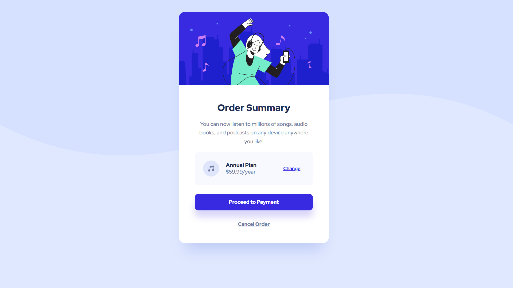

# Frontend Mentor - Order summary card solution

This is a solution to the [Order summary card challenge on Frontend Mentor](https://www.frontendmentor.io/challenges/order-summary-component-QlPmajDUj). Frontend Mentor challenges help you improve your coding skills by building realistic projects.

## Table of contents

- [Overview](#overview)
  - [The challenge](#the-challenge)
  - [Screenshot](#screenshot)
  - [Links](#links)
- [My process](#my-process)
  - [Built with](#built-with)
  - [What I learned](#what-i-learned)
- [Author](#author)

## Overview

### The challenge

Users should be able to:

- See hover states for interactive elements

### Screenshot

### Links

- Solution URL: [Add solution URL here](https://your-solution-url.com)
- Live Site URL: [Add live site URL here](https://your-live-site-url.com)

## My process

### Built with

- Semantic HTML5 for markup
- Custom CSS3 properties for style
- FlexBox
- Responsive design

### What I learned

As I started this challenge to brush up the markup and cascading skills. By doing this challenge also helps to learn the responsive design by using media queries with various view ports.

## Author

- Website - [Sulthan Mohaideen](https://sulthannk.me)
- Frontend Mentor - [@SulthanNK](https://www.frontendmentor.io/profile/SulthanNK)
- Twitter - [@SulthanNK](https://twitter.com/SulthanNK)
